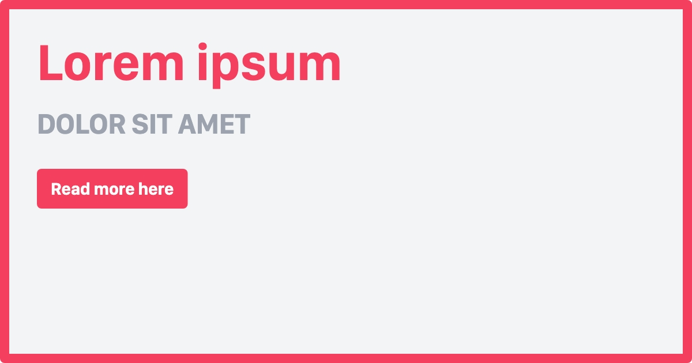

# Laravel Open Graph dynamic images


[](https://github.com/vormkracht10/laravel-open-graph-image/actions/workflows/run-tests.yml)

[](https://packagist.org/packages/vormkracht10/laravel-open-graph-image)
[](https://packagist.org/packages/vormkracht10/laravel-open-graph-image)

This Laravel package enables you to dynamically create Open Graph images for your website. Just add the meta tag with our url to the head of your page. The package will then generate the image and add it to the page. You can edit the view template which you can find in the resources folder.

## Installation

You can install the package via composer:

```bash
composer require vormkracht10/laravel-open-graph-image
```

Then you should install puppeteer:
    
```bash
npm install puppeteer
```

You should publish the views using:

```bash
php artisan vendor:publish --tag="open-graph-image-views"
```

You can optionally publish the config using:

```bash
php artisan vendor:publish --tag="open-graph-image-config"
```

This is the content of the published config file (published at `config/open-graph-image.php`):

```php
return [
    'image' => [
        'extension' => 'jpg',
        'quality' => 100,
        'width' => 1200,
        'height' => 630,
    ],

    // The cache location to use.
    'storage' => [
        'disk' => 'public',
        'path' => 'social/open-graph',
    ],

    // Whether to use the browse URL instead of the HTML input.
    // This is slower, but makes fonts available.
    // Alternative: http
    'method' => 'html',

    'metatags' => [
        'og:title' => 'title',
        'og:description' => 'description',
        'og:type' => 'type',
        'og:url' => 'url',
    ],
];
```
    
## Usage

Just add this blade component into the head of your page.

```html
<x-open-graph-image::metatags title="Lorem ipsum" subtitle="Dolor sit amet" />
```

When you share the page on any platform, the image will automatically be generated, cached and then shown in your post. The image from the default template will look like this:


    

This component uses the 'template' blade view by default. You can change this template to your needs. It is even possible to pass more attributes than the default ones. You can find the default template in the resources folder. 

### Clearing cached images

All generated open graph images are cached by default. If you want to remove the cache, you can use the following command:

```bash
php artisan open-graph-image:clear-cache
```


## Changelog

Please see [CHANGELOG](CHANGELOG.md) for more information on what has changed recently.

## Contributing

Please see [CONTRIBUTING](https://github.com/vormkracht10/.github/blob/main/CONTRIBUTING.md) for details.

## Security Vulnerabilities

Please review [our security policy](../../security/policy) on how to report security vulnerabilities.

## Credits

- [Bas van Dinther](https://github.com/baspa)
- [Mark van Eijk](https://github.com/markvaneijk)
- [All Contributors](../../contributors)

## License

The MIT License (MIT). Please see [License File](LICENSE.md) for more information.
